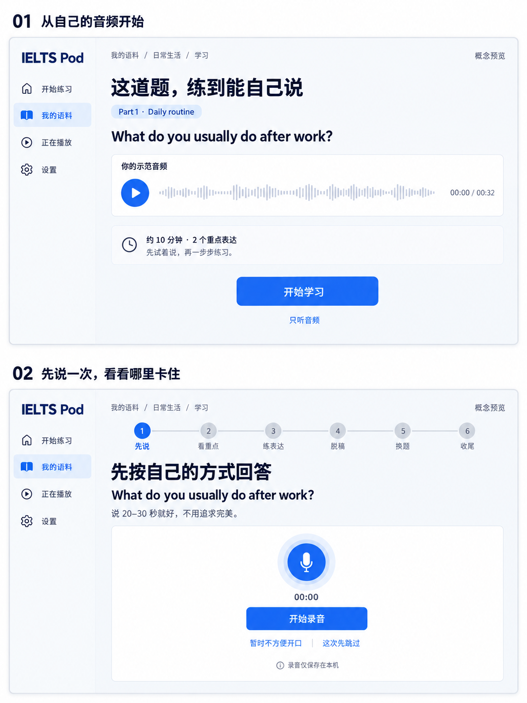
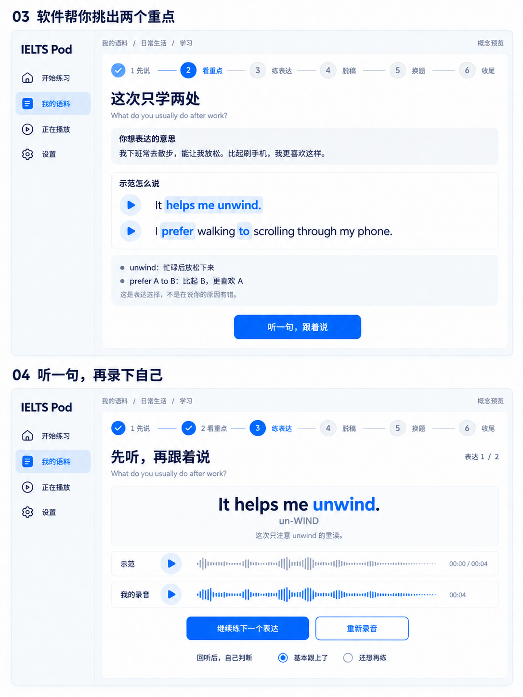
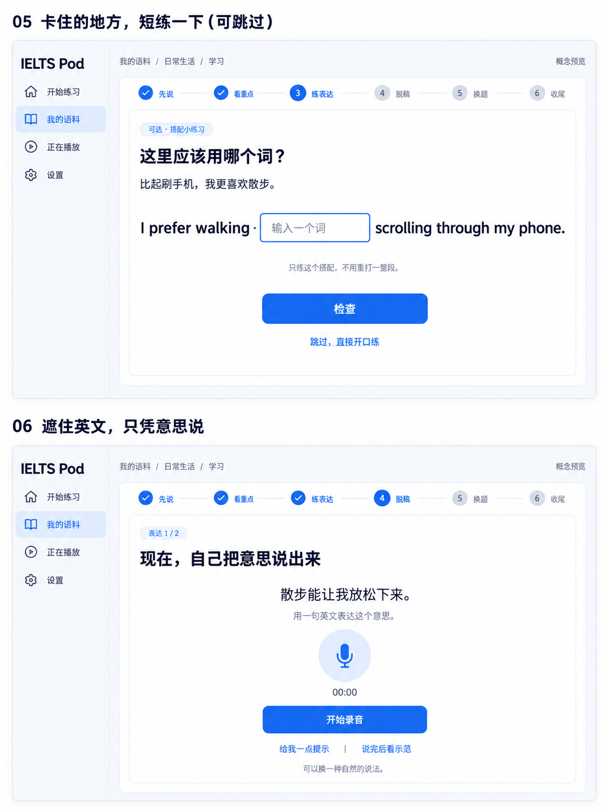
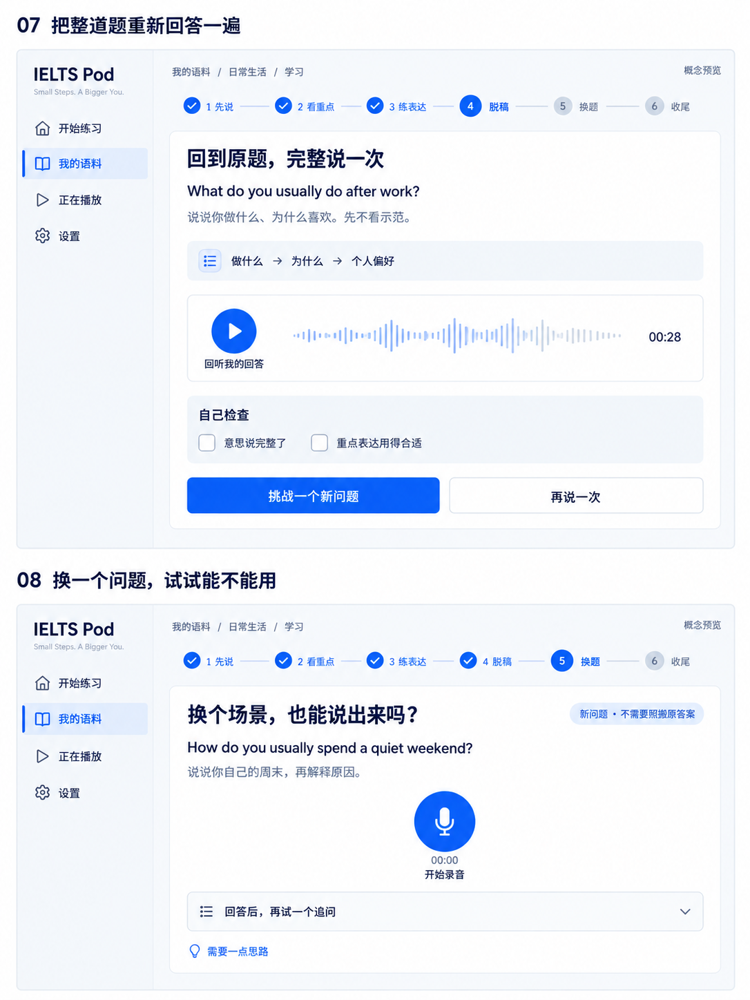
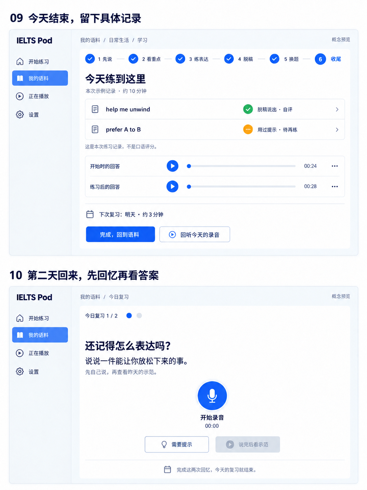

# 一道雅思题的学习流程：界面概念图

2026-09-28。五张桌面端概念图，每张上下两个连续界面，共十个状态。使用内置 ImageGen 生成，尚未开发。

沿用 IELTS Pod 的白底、深蓝文字与蓝色主按钮。示例题为 **What do you usually do after work?**，以「下班散步，让自己放松，比刷手机更喜欢散步」为个人原意。图中的录音、时长和自评结果均为示意。

这十个状态不是十项强制任务：填空可跳过；跟读图展示的是录音后的回听状态；次日复习是下次打开应用时发生的事。

| 界面 | 用户看到什么 | 用户做什么 | 做完去哪里 |
| --- | --- | --- | --- |
| 01 开始 | 已有音频、本次约十分钟、两个重点 | 点击「开始学习」 | 02 |
| 02 先说 | 原题，没有示范答案 | 录一段自己的回答；录音中按钮变为「结束录音」，结束后可回听并继续 | 03 |
| 03 看重点 | 个人原意与两处英文表达，附解释和播放按钮 | 看懂差别，点击「听一句，跟着说」 | 04 |
| 04 跟读 | 一句示范、当前听音重点、示范和自己的录音 | 听后录音、回听、自评；继续另一个表达 | 05 或 06 |
| 05 可选填空 | 一个关键介词空格 | 填词并检查；反馈解释后再说一句，或直接跳过 | 06 |
| 06 脱稿短句 | 只有中文意思，没有英文答案 | 说出英文；卡住可要提示，说完再对照并自评 | 07 |
| 07 完整回答 | 原题和中文内容线索、刚录下的完整回答 | 重新回答、回听；点击「挑战一个新问题」 | 08 |
| 08 换题 | 周末话题，没有目标表达提示 | 用自己的新内容回答，再试一个追问 | 09 |
| 09 收尾 | 两个表达的本次练习记录、前后录音、下次复习 | 回听比较，点击「完成，回到语料」 | 自由收听；次日 10 |
| 10 次日复习 | 两个短回忆任务，先不显示答案 | 先自己说，之后看示范、回听并自评 | 完成今日复习 |

## 01–02：进入学习，先自己说

## 03–04：看懂重点，听音跟读

## 05–06：局部填空，遮住答案口答

## 07–08：完整回答，换题使用

## 09–10：记录本次练习，隔天复习

## 本版界面的明确约定

- 软件组织顺序、提供素材和提示；用户负责开口、回听与第一版自评。
- 点击录音后可停止、重录；完成当前口答后才进入示范对照。图片选取了部分关键状态，没有穷举每次按钮变化。
- 回答不同于示范但意思成立，不直接判错。表达目标是否提取出来另行记录。
- 填空用于需要补练的搭配；「检查」可判定这个受限文本任务，不意味着能自动判断开放口答。
- 看答案或用提示后，本轮不能算作无提示成功；总结显示自评，不给自动口语分数。
- 次日用短复习入口，不重新走完当天六阶段。
- 本组只表达桌面端用户流程；移动布局、麦克风权限/失败等状态留待选定方案后设计。

视觉核查：五张图均已查看；修正了图 2 的题干漂移，以及图 5 次日复习误带完整六阶段导航的问题。整体流程、关键按钮、中文提示和隐藏答案状态可辨认。生成图片中的细微字体、图标和间距差异不作为实现规范。

研究依据见 [学习模式研究报告](../../LEARNING_MODE_RESEARCH.md)；完整生成与修订提示词见 [PROMPTS.md](PROMPTS.md)。
