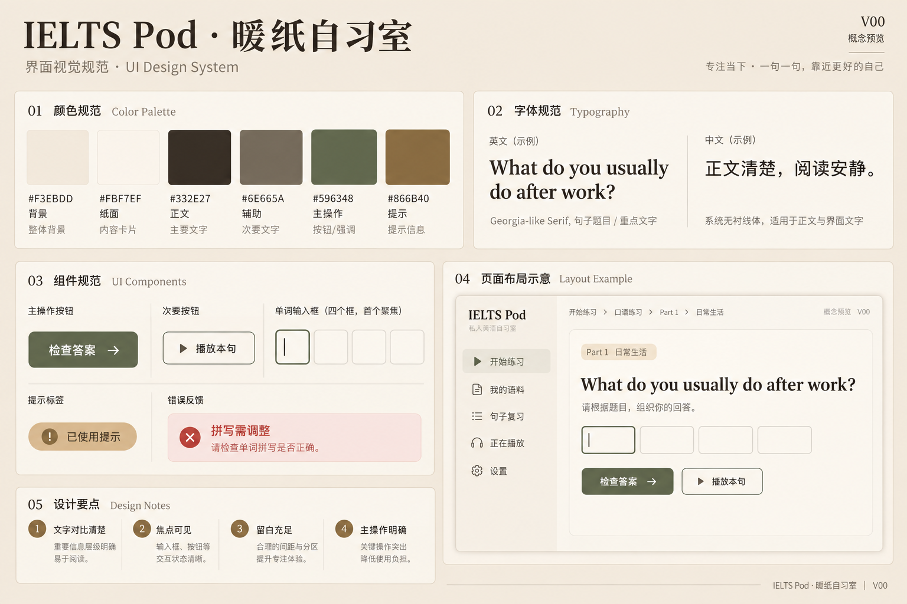
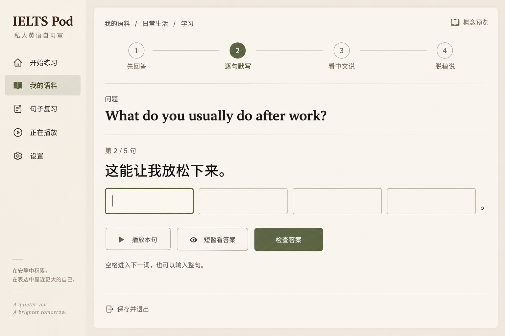
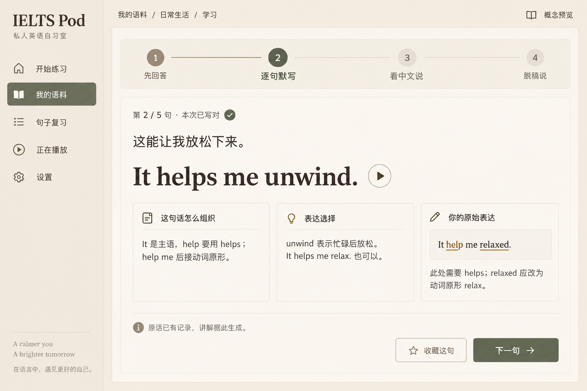
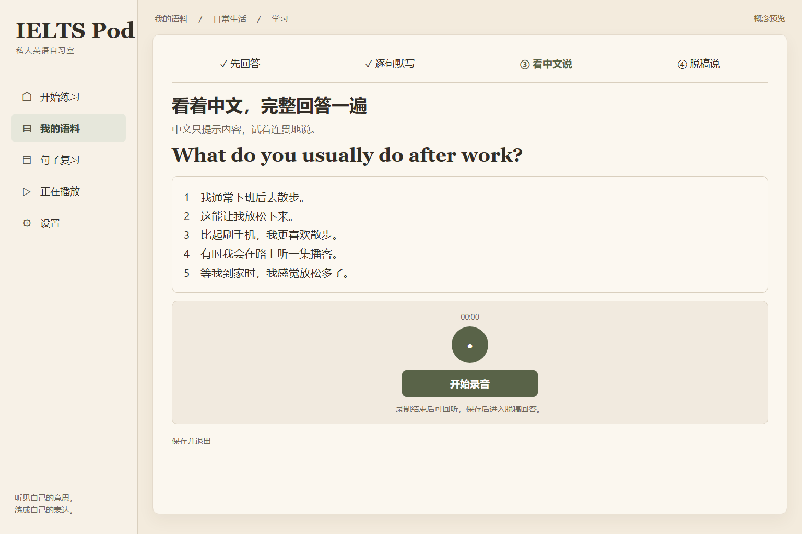
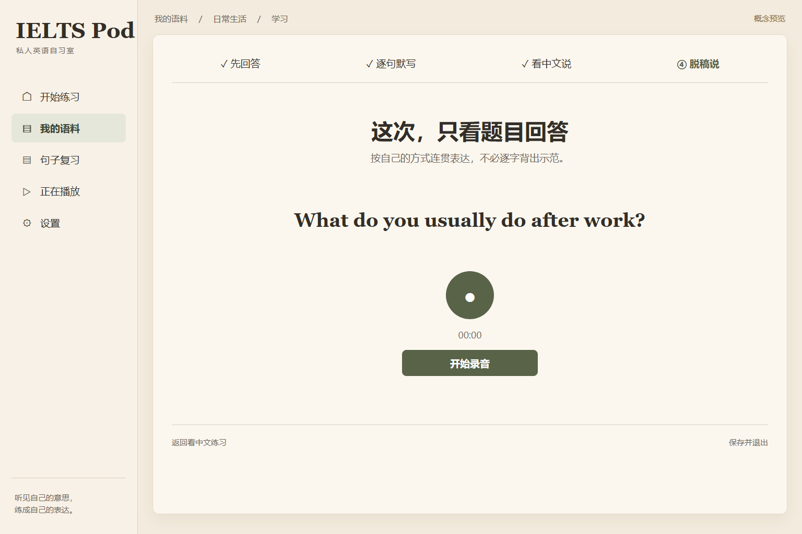

# IELTS Pod「暖纸自习室」桌面设计交接

2026-09-29 Bruce 选定。本目录是 L01 的桌面概念交接；L02/L03 已据此实现桌面学习模式和暖纸样式。
图片仍是布局参考，具体行为与文案以本目录文字规范及运行中的产品为准。

本目录包含 33 张主界面图、8 张状态组图及 1 张视觉规范图。按下方编号阅读，也可以单击图片放大。全部图片位于 `images/`；可复用的生成提示词、图片路径和入口／动作／后继状态在 [catalog.json](catalog.json)。

## 先看主流程

生成完成后，音频即可播放；用户主动点击「开始学习」。本题依次完成：学习前录音 → 五句逐句整句默写和讲解 → 看完整中文录音 → 只看题目录音 → 比较录音与复习句子。拼写覆盖整篇回答。

- 准确文案、词框数量和原话证据：[示例数据](EXAMPLE_CONTENT.md)
- 操作、提示、录音、复习和失败恢复：[交互规范](INTERACTIONS.md)
- 色彩、排版、组件与阅读层级：[视觉规范](VISUAL.md)
- 后续实施顺序与接口边界：[开发交接](DEVELOPMENT_HANDOFF.md)
- 旧文档如何处理：[文档审计](DOCUMENT_AUDIT.md)

## 初次配置、选题与生成

| 编号 | 页面或状态 | 用户动作 | 下一步 | 图片 |
| --- | --- | --- | --- | --- |
| A01 | 连接语音服务 | 配置并测试连接 | A02 | [打开 PNG](images/A01.png) |
| A02 | 选择提问者 | 试听并选择声音 | A03 | [打开 PNG](images/A02.png) |
| A03 | 选择回答者 | 试听、选择并保存 | A04 | [打开 PNG](images/A03.png) |
| A04 | 题库与筛选 | 筛选或选择一道题 | A05/A06 | [打开 PNG](images/A04.png) |
| A05 | 普通题作答 | 输入中文、英文或混合回答 | A07/A08 | [打开 PNG](images/A05.png) |
| A06 | Part 2 长题卡作答 | 阅读完整提示并输入回答 | A07/A08 | [打开 PNG](images/A06.png) |
| A07 | Agent 等待 | 复制指令并等待完成 | A09 | [打开 PNG](images/A07.png) |
| A08 | API 生成进度 | 查看阶段进度 | A09 | [打开 PNG](images/A08.png) |
| A09 | 音频与材料完成 | 听音频或进入学习 | A12/B01 | [打开 PNG](images/A09.png) |

## 语料、播放与设置

| 编号 | 页面或状态 | 用户动作 | 下一步 | 图片 |
| --- | --- | --- | --- | --- |
| A10 | 我的语料 | 选择题目或继续学习 | A11/B01 | [打开 PNG](images/A10.png) |
| A11 | 话题回答列表 | 选择听或学 | A12/B01 | [打开 PNG](images/A11.png) |
| A12 | 精听播放器 | 听音、点句、查看中文 | B01 | [打开 PNG](images/A12.png) |
| A13 | 设置 | 配置声音与学习偏好 | A14/S08 | [打开 PNG](images/A13.png) |
| A14 | 音色展台 | 试听并选择角色声音 | A13 | [打开 PNG](images/A14.png) |
| A15 | 语料包导入 | 选择文件或局域网导入 | A10 | [打开 PNG](images/A15.png) |
| A16 | 语料包导出 | 选择范围并导出 | A10 | [打开 PNG](images/A16.png) |
| A17 | 高级内容管理 | 维护话题、生成和导出 | A18/A19 | [打开 PNG](images/A17.png) |
| A18 | 条目编辑 | 编辑已有文本并保存 | A17 | [打开 PNG](images/A18.png) |
| A19 | 整集与章节播放 | 查看章节并播放导出 | A17 | [打开 PNG](images/A19.png) |

## 进入学习与逐句默写

| 编号 | 页面或状态 | 用户动作 | 下一步 | 图片 |
| --- | --- | --- | --- | --- |
| B01 | 单题学习入口 | 开始或继续本题学习 | B02/B03 | [打开 PNG](images/B01.png) |
| B02 | 学习前录音 | 录下未看答案的回答 | B03 | [打开 PNG](images/B02.png) |
| B03 | 整句默写 | 根据中文输入整句 | B04/B06 | [打开 PNG](images/B03.png) |
| B04 | 默写错误与修正 | 定位并修正拼写 | B06 | [打开 PNG](images/B04.png) |
| B05 | 完整英文短暂提示 | 看提示后继续填写 | B03/B04 | [打开 PNG](images/B05.png) |
| B06 | 逐句讲解 | 阅读讲解并进入下一句 | B03/B07 | [打开 PNG](images/B06.png) |

## 口答、复习与记录

| 编号 | 页面或状态 | 用户动作 | 下一步 | 图片 |
| --- | --- | --- | --- | --- |
| B07 | 看完整中文口答 | 看中文连贯回答并保存 | B08 | [打开 PNG](images/B07.png) |
| B08 | 仅看原题脱稿口答 | 脱稿回答并保存 | B09 | [打开 PNG](images/B08.png) |
| B09 | 本次学习完成 | 回听、查看困难句 | B10/B11/A11 | [打开 PNG](images/B09.png) |
| B10 | 录音历史与对比 | 切换与对比所有录音 | B01 | [打开 PNG](images/B10.png) |
| B11 | 句子复习库 | 筛选并开始复习 | B12/B13 | [打开 PNG](images/B11.png) |
| B12 | 句子详情 | 查看来源、讲解与历史 | B13/A11 | [打开 PNG](images/B12.png) |
| B13 | 句子复习默写 | 中文提示下再次默写 | 下一复习句/B14 | [打开 PNG](images/B13.png) |
| B14 | 复习结束 | 查看本轮记录 | B11/A10 | [打开 PNG](images/B14.png) |

## 关键状态

| 编号 | 页面或状态 | 用户动作 | 下一步 | 图片 |
| --- | --- | --- | --- | --- |
| S01 | 录音状态 | 录制、回听与重录 | 对应下一阶段 | [打开 PNG](images/S01.png) |
| S02 | 提示显示与消散 | 等待提示隐藏并继续 | B03 | [打开 PNG](images/S02.png) |
| S03 | 默写反馈集合 | 理解反馈并修正 | B04/B06 | [打开 PNG](images/S03.png) |
| S04 | 长内容排版 | 输入、展开、滚动 | 同一流程 | [打开 PNG](images/S04.png) |
| S05 | 学习材料准备与缺失 | 等待、补齐或重试 | B01/A12 | [打开 PNG](images/S05.png) |
| S06 | 权限与保存异常 | 处理异常或退出 | 恢复原状态 | [打开 PNG](images/S06.png) |
| S07 | 空状态与业务失败 | 执行下一步 | 对应业务页面 | [打开 PNG](images/S07.png) |
| S08 | 辅助操作与偏好 | 保存、确认、设置 | 恢复/退出 | [打开 PNG](images/S08.png) |

## 视觉样张

以下几张依次展示学习主线的关键操作；全部 42 张均在上面的索引内。

### V00 色彩与组件

### B03 中文提示下的整句默写

### B06 写对后的逐句讲解

### B07 看完整中文回答

### B08 只看题目脱稿回答

## 使用时的优先级

交互和准确文案以本目录的文字规范、示例数据为准；图像用于理解空间和视觉关系。部分 ImageGen 图片有细微字词或状态偏差，八张重要界面以可查看的静态 HTML/CSS 源重渲染。所有图里的录音时长、进度和答案均为合成示例。旧蓝白概念图为历史材料。

最终图像来源：33 张为内置 ImageGen；A05、A12、A13、B02、B04、B07、B08、B14、S07 为静态 HTML/CSS 通过本地 Playwright 渲染，其中 7 张修正了生成图的关键文案或阶段。绘图服务额度到顶后继续使用可复现的静态页面源，没有切换到需要 API Key 的 CLI。

本轮只出桌面图。Android 版学习页面及跨设备记录同步另行设计；当前 Web/Android 产品仍共享现有前端。
